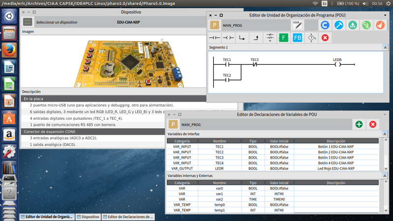

# Instalación de IDE4PLC

### Por Ing. Eric Pernia.

## Windows

Descargar e instalar CIAA-IDE Suite (con las opciones por defecto) del siguiente enlace:

[Setup_CIAA_IDE_Suite_v1.2.2.zip](https://github.com/ciaa/Software-IDE/releases/download/v1.2.2/Setup_CIAA_IDE_Suite_v1.2.2.zip)

Una vez instalado hay que actualizar el driver de FTDI con Zadig para poder bajarle programas a las placas CIAA-NXP y EDU-CIAA-NXP como explica acá:

http://www.proyecto-ciaa.com.ar/devwiki/doku.php?id=desarrollo:firmware:instalacion_sw#openocd

Luego reemplazar las carpetas "Firmware" e "IDE4PLC" en "C:/CIAA" por las versiones de la release que desee utilizar.

Con eso se actualizan las versiones de Firmware e IDE4PLC con respecto a las que trae el instalador "Setup_CIAA_IDE_Suite_v1.2.2.zip".

## Linux

Para Linux existen 2 versiones, una para sistemas x86 y otra para x64.

Antes de instalar IDE4PLC debe instalar el compilador y debugger, esto puede realizarlo siguiento estas guías segun so distribución:

- [Instalación de CIAA Firmware en Linux Ubuntu](http://www.proyecto-ciaa.com.ar/devwiki/doku.php?id=docu:fw:bm:ide:install_linux). Realizar los 13 pasos de "Configuración de las herramientas por línea de comandos".
- [Instalación de CIAA Firmware en Linux Debian](http://www.proyecto-ciaa.com.ar/devwiki/doku.php?id=docu:fw:bm:ide:install_linux_debian). Realizar los 13 pasos de "Configuración de las herramientas por línea de comandos".
- [Instalación de CIAA Firmware en Linux Huayra](https://2mp.conae.gov.ar/attachments/article/1313/SAE-MAN-0002-D%20-%20Manual%20instalacion%20IDE%20y%20compilacion.pdf). Realizar todos los pasos de la sección 1.2 "Instalación en Linux".

Luego reemplazar las carpetas "Firmware" e "IDE4PLC" en "$HOME/ciaa-ide/" por las versiones de la release que desee utilizar.
