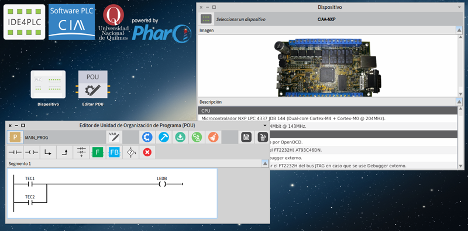

# IDE4PLC

A libre Programming Software for PLC comply with IEC 61131-3.



## License

Copyright 2012-2017 Eric Nicolás Pernia.

This program is free software: you can redistribute it and/or modify it under the terms of the GNU Lesser General Public License as published by the Free Software Foundation, either version 3 of the License, or (at your option) any later version.

This program is distributed in the hope that it will be useful, but WITHOUT ANY WARRANTY; without even the implied warranty of MERCHANTABILITY or FITNESS FOR A PARTICULAR PURPOSE.  See the GNU Lesser General Public License for more details.

You should have received a copy of the GNU Lesser General Public License along with this program.  If not, see <http://www.gnu.org/licenses/>.

```
For more information about the license, read the files
COPYING.LESSER.txt and COPYING.txt located in the 
IDE4PLC_LICENSE directory.
```

## Project information

- Web sites:
    - https://ide4plc.org/
    - http://www.proyecto-ciaa.com.ar/devwiki/doku.php?id=desarrollo:software-plc
- IDE4PLC project E-mail: ide4plc@gmail.com
- Soft-PLC development group of CIAA project: https://groups.google.com/forum/#!forum/ciaa-software-plc
   
### About the author
   
- Ing. Eric Nicolás Pernia (ericpernia@gmail.com). Quilmes, Buenos Aires, Argentina.
- Professor-Researcher at Universidad Nacional de Quilmes (UNQ).
- Responsible for Software-PLC in CIAA Project.
   
### Collaborator in software design and coding

- Dr. Lic. Carlos Lombardi.
- Sub-responsable for Software-PLC in CIAA Project.
   
### Collaborators in the port of the Firmware of IDE4PLC to the EDU-CIAA-NXP

- Mariano Cerdeiro. Responsible for Firmware in CIAA Project.
- Pablo Ridolfi. Responsible for Hardware in CIAA Project.
- Juan Cecconi. Sub-responsable for CIAA-IDE in CIAA Project.
- Leandro Kollenberger.

### Collaborators in software diffusion and testing

- Gerardo Sager.
- María de los Angeles Gómez López.

### Collaborator in software testing and documentation

- Marcelo Chichiri.